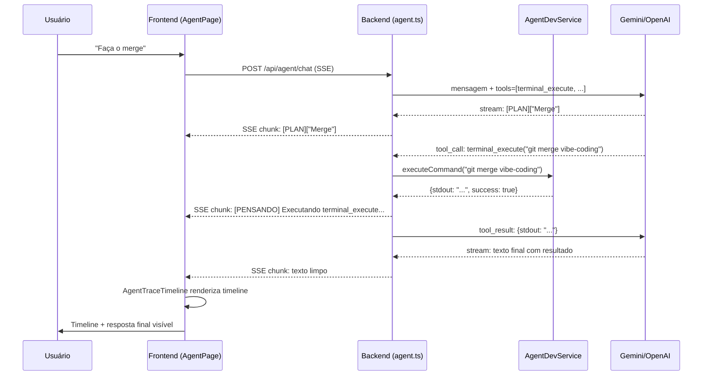

# 🖥️ Auditoria: Estratégia Terminal Black Box — CAPTU AI

> Estado atual do sistema em **23/03/2026**. Mapeamento completo de todos os arquivos envolvidos.

---

## 📐 Arquitetura Geral

```
FRONTEND (React)                    BACKEND (Express + Node)
─────────────────                   ─────────────────────────
AgentPage.tsx                ←SSE→  agent.ts (route)
  └─ MessageBubble.tsx               └─ agentDevService.ts
       └─ AgentTraceTimeline.tsx          └─ executeCommand() → child_process.exec
```

O sistema tem **dois planos**: um visual (Timeline no chat) e um de execução real (terminal no servidor).

---

## 🔧 Camada 1 — Execução Real no Servidor

### `backend/src/services/agentDevService.ts`
**Responsabilidade:** Executa comandos de sistema no servidor.

| Método | Descrição |
|--------|-----------|
| `executeCommand(command)` | Roda via `child_process.exec` (promisificado). CWD = raiz do projeto. Retorna `{stdout, stderr, success}`. |
| `readFile(path)` | Lê arquivo do projeto via `fs.readFile`. |
| `writeFile(path, content)` | Cria/sobrescreve arquivo (cria dirs automaticamente). |
| `patchFile(path, search, replace)` | Substitui trecho no arquivo. Tenta match exato, depois regex normalizada. |
| `getFileTree(dir, maxDepth)` | Árvore de arquivos recursiva (ignora `node_modules`, `.git`, `dist`). |
| `gitOperation(action, params)` | Atalhos Git: `branch`, `commit`, `status`. |

> [!WARNING]
> `executeCommand` usa `exec` **síncrono por promise** (sem streaming). O resultado só aparece no chat **após o comando terminar completamente** — não há output linha-a-linha em tempo real para o usuário.

> [!CAUTION]
> Existe apenas um bloqueio de segurança primitivo: bloqueia `rm -rf /` e fork bomb. Qualquer outro comando perigoso passa livre.

---

## 🔧 Camada 2 — Ferramenta `terminal_execute` na IA

### `backend/src/routes/agent.ts` — `CAPTU_TOOLS` (linha 206–216)

A IA tem acesso à ferramenta `terminal_execute`, definida assim:

```json
{
  "name": "terminal_execute",
  "description": "Executa comandos no terminal do servidor (CMD/Powershell)...",
  "parameters": {
    "command": "string"
  }
}
```

### Despachante (linha 300–302)
```typescript
} else if (name === 'terminal_execute') {
  const res = await AgentDevService.executeCommand(args.command);
  toolResult = res;
}
```

**Fluxo completo:**
1. Usuário pede algo (ex: "Faça o merge")
2. IA (Gemini ou OpenAI) decide chamar `terminal_execute`
3. Backend chama `AgentDevService.executeCommand()`
4. `exec()` roda o comando no servidor
5. Resultado (`stdout`/`stderr`) volta para a IA como contexto
6. IA gera a resposta final com os logs

> [!NOTE]
> O output do terminal **volta para a IA** como ferramenta, não diretamente para o frontend. O usuário vê o log textual na resposta final da IA, não em tempo real no terminal.

---

## 🔧 Camada 3 — Sinalização Visual (Tags de Sistema)

### Como a IA sinaliza que está "no terminal"

A IA emite tags especiais no stream SSE:

| Tag | Significado |
|-----|-------------|
| `[PLAN] ["Step 1", "Step 2"]` | Define o plano de execução |
| `[STEP_START] 1` | Inicia o passo 1 |
| `[PENSANDO] Executando terminal_execute...` | Chamou uma ferramenta |
| `[TERMINAL] git merge vibe-coding` | Log de terminal |
| `[STEP_DONE] 1` | Passo 1 concluído |

Essas tags são geradas:
- **Automaticamente** pelo `processGemini()` (`agent.ts` linha 409): `\n[PENSANDO] Executando ${toolName}...\n`
- **Pelo próprio modelo** se o system prompt o instruir a emitir `[TERMINAL]`, `[GIT]`, etc.

---

## 🔧 Camada 4 — Timeline Visual no Chat

### `src/components/agent/AgentTraceTimeline.tsx`

Consome o `content` da mensagem em streaming e parseia as tags em tempo real:

```
[PLAN] → cria os "steps" da timeline
[STEP_START] → coloca o step como "running" (spinner)
[PENSANDO] [TERMINAL] [GIT] → sub-steps com ícone Terminal/GitBranch
[STEP_DONE] → step vira "done" (check verde)
```

**Sub-steps reconhecidos:**
`PENSANDO | TERMINAL | WEB | SUPABASE | CODE | GIT | BUSCANDO | ANALISANDO | RESEARCH | PRISMA`

**Ícones mapeados:**
- `TERMINAL` → ícone `Terminal`
- `GIT` → ícone `GitBranch`
- `SUPABASE` → ícone `Database`
- `WEB` → ícone `Globe`

### `src/components/agent/MessageBubble.tsx` (linha 317)

Ativa a timeline automaticamente se o conteúdo contiver qualquer tag conhecida:
```typescript
const isComplex = message.isComplex ?? /\[(PLAN|STEP_START|STEP_DONE|PENSANDO|TERMINAL|...)\]/i.test(message.content);
```

---

## 🔧 Camada 5 — Limpeza Final do Texto

### `MessageBubble.tsx` — `cleanSystemTags()` (linha 42–68)

Antes de renderizar o markdown final, todas as linhas com tags de sistema são **filtradas e removidas**. O usuário vê apenas o texto limpo e os artefatos.

---

## 🗺️ Diagrama do Fluxo Completo



---

## ⚠️ Problemas e Gaps Identificados

| # | Problema | Impacto |
|---|----------|---------|
| 1 | **Sem streaming real do terminal** — `exec` só retorna após o comando terminar | Para comandos longos (git, npm), o usuário fica sem feedback até terminar |
| 2 | **Tags `[TERMINAL]` dependem da IA emitir** — a IA pode não emitir essas tags consistentemente | Timeline pode não mostrar sub-steps de terminal |
| 3 | **System prompt não força `[TERMINAL]`** — o prompt em `agent.ts` (linha 362–363) não instrui a IA a usar as tags de log | A IA frequentemente só emite `[PENSANDO]` sem detalhar o comando |
| 4 | **`terminal_execute` sem janela física** — é invisível ao usuário fora do chat | Não existe uma janela PowerShell real abrindo |
| 5 | **Segurança mínima** — `AgentDevService` aceita qualquer comando | Risco de execução indesejada |

---

## ✅ O que Está Funcionando

- ✅ Ferramenta `terminal_execute` existe e é chamada pela IA (Gemini e OpenAI)
- ✅ `AgentDevService.executeCommand()` roda comandos reais no servidor
- ✅ Timeline visual parse tags em tempo real
- ✅ Tags `[PENSANDO]` são geradas automaticamente ao chamar qualquer ferramenta
- ✅ Texto de sistema é limpo antes da renderização final

---

## 🚀 Próximos Passos Recomendados

1. **Trocar `exec` por `spawn`** em `AgentDevService` para habilitar streaming real linha-a-linha
2. **Criar endpoint SSE dedicado** `/api/agent/terminal` para executar comandos com stream de saída
3. **Injetar instrução no system prompt** para que a IA emita `[TERMINAL] <comando>` antes de chamar `terminal_execute`
4. **Adicionar validação de comandos** em allowlist (git, npm, npx, etc.)
